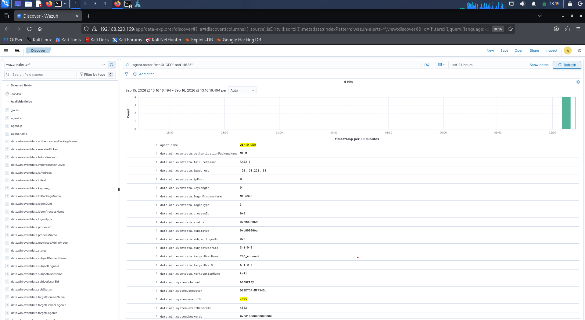
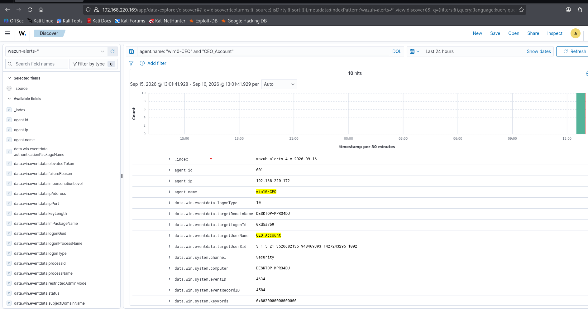
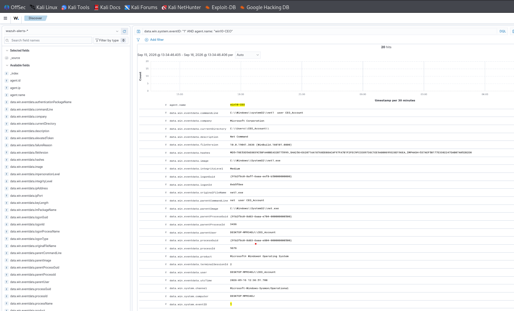

# CEO Account Takeover Investigation & Incident Response

## Executive Summary
This project demonstrates an end-to-end investigation of a compromised executive account (**CEO_Account**) on a Windows 10 host monitored by **Wazuh SIEM** and **Sysmon**. The investigation traces the attack sequence from initial reconnaissance and brute-force access to interactive RDP hijacking and post-exploitation execution, mapped against the **MITRE ATT&CK** framework.

---

## Technical Stack & Topology
* **SIEM / Telemetry:** Wazuh Manager (v4.x) & OpenSearch Dashboard
* **Endpoint Telemetry:** Windows 10 Enterprise with Sysmon Integration
* **Attacker Machine:** Kali Linux (Hydra, FreeRDP)
* **Monitored Agent:** `win10-CEO` (IP: `192.168.220.172`)

---

## Attack Lifecycle & Detection Evidence

### Phase 1: Initial Access & Password Spraying (Brute-Force)
* **Technique:** MITRE ATT&CK T1110.001 (Brute Force: Password Guessing)
* **Description:** The attacker initiated a credential brute-force attack against the `CEO_Account` via RDP using Hydra from host `192.168.220.130`.
* **Detection:** Captured via Windows Security Event ID **4625** (An account failed to log on).

---

### Phase 2: Unauthorized Interactive Access (RDP Logon)
* **Technique:** MITRE ATT&CK T1078 (Valid Accounts) / T1021.001 (Remote Services: RDP)
* **Description:** Upon obtaining valid credentials, the attacker successfully established an interactive Remote Desktop session.
* **Detection:** Wazuh flagged Event ID **4624** with **LogonType 10** (RemoteInteractive) matching `CEO_Account`.

---

### Phase 3: Post-Exploitation Reconnaissance
* **Technique:** MITRE ATT&CK T1087.001 (Account Discovery: Local Account)
* **Description:** After accessing the system, the attacker executed reconnaissance commands (`net user`) to enumerate local account privileges.
* **Detection:** Captured via **Sysmon Event ID 1** (Process Creation) monitoring command-line executions.

---

## Response & Mitigation Strategies
1. **Host Isolation:** Immediate isolation of `win10-CEO` via Wazuh Active Response to block active C2 channels.
2. **Credential Reset:** Enforced immediate password reset for `CEO_Account` and revoked active RDP tokens.
3. **MFA Implementation:** Required Multi-Factor Authentication (MFA) for all external/RDP authentication attempts.
4. **Custom Alerting:** Configured Wazuh rules to trigger high-severity alerts upon detecting multiple failed logins (4625) followed by a successful logon (4624) within 5 minutes.
